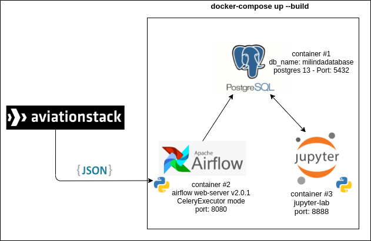
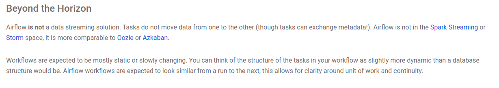

# AviationStack API... a have-fun time

Consuming an [API](https://aviationstack.com/) using Airflow + Postgres + Jupyter-lab + Docker.
 
## How was it born?
Some guys from an important company challenge me to find a solution to a problem. I have to consuming some API data with airflow and store it in a database and show it in a jupyter notebook.
But I have some contraints and nice-to-have aspects. e.g.:

- Python 3.x & Pandas 1.x
- Environment isolation.

## So, What did I do?

I know that the image it's self-explanatory enough so I just want to tell you a little conclusion summary. Now you can access to Airflow and Jupyter-lab from the host (it means from your web browser).
[*if you have more questions about it, please contact me*]

# Getting started

Everything sounds good, but... you may ask "how I can have this working on my machine after clone the repo?" Let's find out.

## Prerequisites

- repo cloned on your computer
- docker-compose
- a web browser :)

that's it.

## Running the docker images

Once the repo has been cloned, open your terminal and move to the folder where the project is placed. 
 
Now, you have to run the following command:

    docker-compose up --build

On your first time running this command, the docker-compose will pull all the images that are needed, so it may take several minutes to complete (it depends on your internet speed and hardware).

Running this command has no end in the console because it makes health checks on the airflow services. 

Please do not run this command in detached mode. We are going to use its info later.

## Airflow

You can access to the 'Airflow web server' copying the following link on your browser.

    http://localhost:8080/

You should see the dag **'flightDag'** on the DAG's section. If you want to add some of your dags, they have to be placed in the dags folder available in the repo folder.

## Jupyter-lab

In order to access jupyter-lab service you have to find in the console the link that the service image gives to you. It looks like this:

    http://127.0.0.1:8888/lab?token=<token>

    for example: http://127.0.0.1:8888/lab?token=6723f8db2c3dd73eceb3582c23d76b851b54a386b3030c9b

Please make sure that you are not using these ports  before running the docker-compose command. If you are and you do not want to close your apps, please map the port to a different one inside de *docker-compose.yml* file.

# Wanna see this working?

Now, in Jupyter-lab you can upload the *Reading_Flights_Data.ipynb*. If you don't know how to do it, [watch this](https://www.youtube.com/watch?v=1bd2QHqQSH4). Keep it there, it is going to be useful later.

On Airflow tab, please enable the DAG: flightdag (just for first time). And run it. 

Please, feel free to check the logs if you find it useful. They are working very well.

Now, our dag has fetch 100 rows from the Flights API and stored it into the postgres database. Run the notebooks cells in order to verify this.

## Good to know

The database and the table are created when the docker runs. But we have to keep in mind some considerations:
- **create table** is working with the clause *'if not exists'*
- the database is **persistent** to your machine (a folder will be created on the repo directory)
- new data from the API is **replacing** the old one. I'm using a *if_exists=replace* option. It could be changed.

So, you may notice, on your first time, if you run the notebook before the dag the table is empty. On the next shots, It will be filled. Actually you are looking the data of the last run (and when you run it, it'll be gone).

That's it! That's how it works!

# What's next?

Unfortunately I runned out of time. The challenge has one week to be completed and at that moment I was really busy, but I've made my way through it.

I find several points of improvement. Let's look out:
### Notebook / Jupyter-lab
- We should have an enviroment with all the packages needed. Maybe miniconda is an option. Working with a image made from *jupyter/datascience-notebook* and added to it. An host-external .yml or requirement.txt would be nice.
- Synchronize a folder with the jupyter workdir inside the container. So, we don't have to upload the notebook that we want to use.

### DAG / Airflow
- Airflow community recommend to use CeleryExecutor mode, but if we are using this for a simple dag like our case. Maybe configure the images to Sequential mode would make the whole package lighter and faster.
- Synchronize the logs to persist them locally (if using disk space is an option).

### Python
- Python scripts are too related to this solution. Making a higher-abstraction level script, the code would be more reusable in other solutions. We would be able to reuse them on different dags.
- Make emphasis on the database connection error handling.

### Variables
- Last but not least. I am using a lot of variables, enviroment stuff and file names that are hard-coded there. So, making an external (host) and user-defined file to handled all of them may be able us to customize our dag. It could be a .env or a .json

# Conclusion

It has been a interesting project. Now you have to think this, It is the solution the fittest one? The API purpose is give **real time** data about flight, but airflow does not work in reat time (you can cron the dags with a few minutes between them but it is no a real time solution). The official documentation warning us about it at the section [Beyond the Horizon](http://airflow.apache.org/docs/apache-airflow/stable/index.html#beyond-the-horizon).

I had so much fun with this challenge! 

Please, if you want to collaborate just fork it and send MR.

Thank you for reading.

